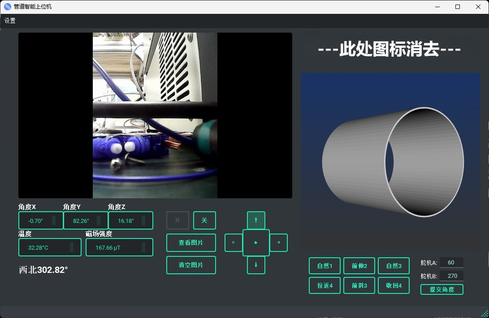

# RPi Monitor Car / 树莓派监控小车

A remote monitoring car project based on Raspberry Pi and a PC client.
一个基于树莓派和上位机的远程监控小车项目。

---

## 📝 Project Overview / 项目简介

This project consists of two main parts:

-   **PC Client (上位机软件代码):** A desktop application built with Python and Qt (`.ui` files) to control the car, view camera feeds, and receive data.
-   **Raspberry Pi (树莓派端代码):** The Python code running on the Raspberry Pi, responsible for controlling the hardware (like motors and gyroscope via `gyro.py`) and communicating with the PC client (`server.py`).

本仓库包含两部分代码：
- **上位机软件 (PC Client):** 基于 Python 和 Qt (`.ui` 文件) 开发的桌面客户端，用于控制小车、查看摄像头实时画面、接收传感器数据。
- **树莓派端 (Raspberry Pi):** 运行在树莓派上的 Python 代码，负责驱动硬件（例如 `gyro.py` 控制陀螺仪）、与上位机进行通信 (`server.py`)。

---

## 🚀 Getting Started / 安装与运行

### 1. Raspberry Pi Setup / 树莓派端

1.  **Hardware / 硬件:**
    *   Raspberry Pi
    *   Gyroscope sensor (e.g., WIT-protocol based)
    *   Camera module
    *   Motor driver and motors

2.  **Software / 软件:**
    *   Clone this repository to your Raspberry Pi.
    *   Install Python dependencies. It seems you are using a custom protocol library `Python-WitProtocol`. Make sure its dependencies are also installed.
    ```bash
    # It's recommended to list dependencies in a requirements.txt file
    # pip install -r requirements.txt 
    ```
    *   Run the server script:
    ```bash
    python3 树莓派端代码/server.py
    ```

### 2. PC Client Setup / 上位机端

1.  **Environment / 环境:**
    *   Clone this repository to your PC.
    *   Install Python dependencies from `requirements.txt`.
    ```bash
    # Navigate to the client directory
    cd 上位机软件代码/yandiansai
    
    # Install dependencies
    pip install -r requirements.txt
    ```

2.  **Running the Application / 运行软件:**
    *   Run the main script:
    ```bash
    python 上位机软件代码/yandiansai/main.py
    ```
    *   Alternatively, you can build the executable using the provided `.spec` file with PyInstaller.
    ```bash
    pyinstaller 上位机软件代码/yandiansai/上位机.spec
    ```

---

## 🖼️ Visuals / 效果图

Here is a screenshot of the PC client in action:
上位机运行效果图：



---

## 📜 License / 开源协议

This project is licensed under the MIT License. See the `LICENSE` file for details.
本项目采用 MIT 协议。详情见 `LICENSE` 文件。