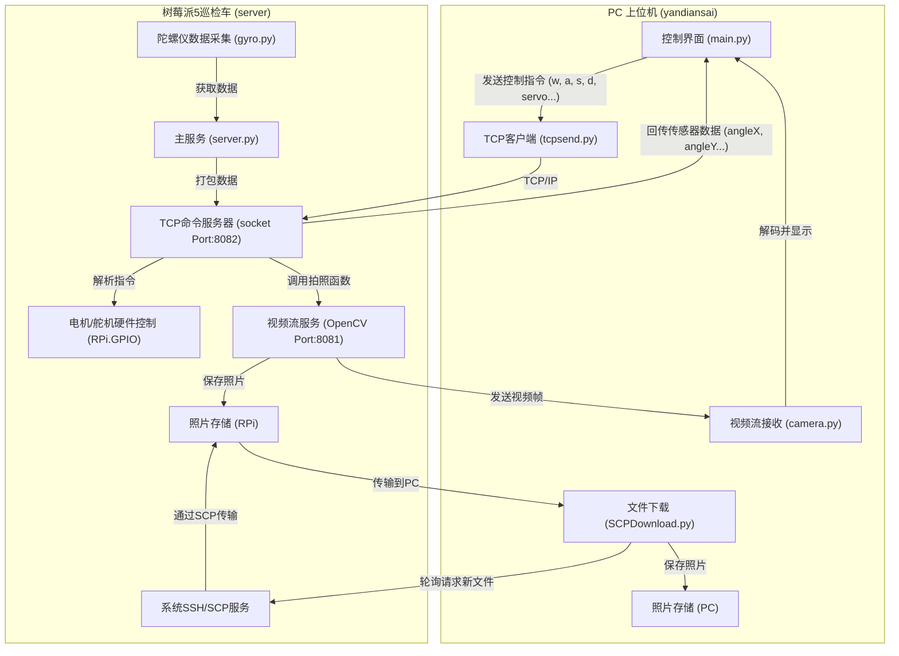

# 管道智能巡检车项目交接文档
通篇干货。

## 1. 项目概述

本项目是一个基于树莓派5的智能巡检车系统，由**树莓派车载端**和**PC上位机控制端**两部分组成，通过Wi-Fi网络进行无线通信。该系统旨在实现对管道等狭窄环境的远程可视化巡检。

*   **车载端核心功能**:
    *   **运动控制**: 驱动直流电机实现前进、后退、左转、右转。
    *   **姿态感知**: 通过JY901S陀螺仪/IMU传感器实时获取车辆的姿态角、温度、磁场等数据。
    *   **视觉采集**: 使用摄像头捕捉实时视频流。
    *   **机械臂操作**: 控制两个舵机组成的简易机械臂执行预设动作。
    *   **通信服务**: 运行一个TCP服务器，接收上位机指令并回传传感器数据。

*   **上位机核心功能**:
    *   **远程遥控**: 提供图形化界面，通过键盘或UI按钮发送控制指令。
    *   **实时监控**: 显示来自车载摄像头的实时视频流。
    *   **数据可视化**: 以仪表盘形式展示车辆的姿态数据，辅以3D模型呈现。
    *   **文件管理**: 自动同步并管理车载端拍摄的照片。

## 2. 系统架构



## 3. 树莓派端 (车载端) 详细部署指南

### 3.1 硬件物料清单 (BOM)

| 类别 | 名称 | 数量 | 备注 |
| :--- | :--- | :--- | :--- |
| **核心** | 树莓派 5 | 1 | |
| | 32GB / 64GB MicroSD 卡（推荐64G） | 1 | |
| | 移动电源 | 1 | 需提供稳定5V/5A供电 |
| **视觉** | 树莓派摄像头模组 | 1 | CSI接口或USB接口均可 |
| **传感** | 维特智能 JY901S 陀螺仪 | 1 | UART通信 |
| **驱动** | TB6612FNG 电机驱动板 (或类似) | 1 | |
| | 直流减速电机 | 2 | |
| | SG90/MG90A 舵机 (推荐MG90A) | 2 | 组成机械臂 |
| **其他** | 杜邦线、车架、轮子等 | 若干 | |

### 3.2 硬件接线配置

**警告：接线前请确保树莓派已断电。所有GPIO引脚编号均基于BCM模式。**

| 组件 | 组件引脚 | 连接至树莓派GPIO引脚 | 功能说明 |
| :--- | :--- | :--- | :--- |
| **电机驱动板** | STBY | 3.3V | 驱动板使能 |
| | PWMA | GPIO 13 (PWM0) | 左轮电机PWM调速 |
| | AIN1 | GPIO 19 | 左轮电机方向控制1 |
| | AIN2 | GPIO 26 | 左轮电机方向控制2 |
| | PWMB | GPIO 16 (PWM0) | 右轮电机PWM调速 |
| | BIN1 | GPIO 20 | 右轮电机方向控制1 |
| | BIN2 | GPIO 21 | 右轮电机方向控制2 |
| | GND | GND | 共地 |
| | VCC/VM | - | 接外部电源正极 (如移动电源12V) |
| **舵机A** | 信号线 (橙色) | GPIO 17 (PWM1) | 舵机A PWM控制 |
| | VCC (红色) | 5V |按照产品使用3.3V/5V |
| | GND (棕色) | GND | 注意共地|
| **舵机B** | 信号线 (橙色) | GPIO 22 | 舵机B PWM控制 |
| | VCC (红色) | 5V | 按照产品使用3.3V/5V|
| | GND (棕色) | GND | 注意共地|
| **JY901S陀螺仪**| VCC | 3.3V | |
| | GND | GND | 注意共地|
| | TX | **GPIO 15 (RXD0)** | 树莓派的接收端 |
| | RX | **GPIO 14 (TXD0)** | 树莓派的发送端 |
| **摄像头** | - | CSI接口 / USB接口 | 视频采集 |

### 3.3 系统镜像部署 (首选方案)

此方案为最快捷的方式，包含了所有配置好的环境和代码。

1.  **下载工具**: 在PC上打开 `Diskgenius_Pro_x64_5.5.0.1488_cn.exe`。
2.  **准备镜像**: 找到项目文件中的 `RPiCC_MonitorCar_SystemImage_Final_20250714_Archived.pmfx`。
3.  **烧录镜像**:
    *   打开 Diskgenius。
    *   选择左侧物理硬盘如“RD1” -> 右键 "将映像文件恢复到磁盘" -> 选中 `.pmfx` 镜像文件。
    *   恢复模式选择“所有文件”。
    *   点击 "开始" 开始烧录，等待完成。
4.  **启动**: 将烧录好的内存卡插入树莓派5，连接好所有硬件并通电启动。

### 3.4 手动环境搭建 (高级/备用方案)
如果您想从一个全新的、纯净的Raspberry Pi OS系统开始，请按以下步骤操作（已经排坑，亲测有效）：

1.  **烧录系统**: 使用 Raspberry Pi Imager 烧录最新的 "Raspberry Pi OS with desktop (64-bit)"。
2.  **基础配置**:
    *   通过外接显示器和键鼠完成首次启动向导。
    *   在终端中，启用 **SSH**, **VNC**, **UART (Serial Port)**, 和 **Legacy Camera Support** (如果使用旧款摄像头)。可通过 `sudo raspi-config` 命令进行设置。
    *   开启UART (Serial Port)可能弹出**Serial Console**提示，要选择否或者关闭。
3.  **安装系统依赖**:
    ```bash
    sudo apt-get update
    sudo apt-get install -y python3-pip python3-opencv libatlas-base-dev
	sudo pip3 install RPi.GPIO --upgrade
    ```
4.  **安装Python库**:
    ```bash
    pip3 install pyserial numpy
    ```
    (注意：`server.py` 的依赖相对简单，主要是 `RPi.GPIO` 和 `opencv-python`，`pyserial` 是陀螺仪库需要的)。
5.  **部署代码**: 将 `树莓派端代码` 中的所有文件和目录，上传到树莓派的 `/home/用户名/Desktop/server/` 目录下。

### 3.5 网络配置与模式切换

系统内置了通过 `nmcli` (NetworkManager命令行工具) 控制的两种网络模式。

#### 3.5.1 AP模式 (默认热点模式)

*   **用途**: 无需外部路由器，方便户外或现场快速部署。
*   **状态**: 系统镜像烧录后首次启动即进入此模式。
*   **网络详情**:
    *   **Wi-Fi名称 (SSID)**: `MyPiAP`
    *   **密码**: `raspberry`
    *   **树莓派IP**: `192.168.12.1`
*   **切换到此模式**:
    ```bash
    # 如果当前在STA模式，可SSH连接后运行
    sudo /home/user0000/Desktop/server/start-ap.sh
    ```

#### 3.5.2 STA模式 (Wi-Fi客户端模式)

*   **用途**: 连接到现有Wi-Fi网络，方便远程开发、调试和访问互联网。
*   **配置方法**:
    1.  **确保您有一个名为 `LAPTOP-PEDRO`，密码为 `00000000` 的Wi-Fi热点**。`start-wifi.sh`脚本会优先尝试连接这个网络。这是最快的连接方式。
    2.  **如果无法创建上述热点**，请按以下步骤操作：
        a. 在AP模式下，使用SSH连接到树莓派 (`ssh user0000@192.168.12.1`，密码 `0000`)。
        b. 在SSH终端中，编辑 `start-wifi.sh` 文件：`nano /home/user0000/Desktop/server/start-wifi.sh`。
        c. 找到 `nmcli device wifi connect ...` 这一行，将其修改为您的Wi-Fi信息：
           ```bash
           # 将 "您的Wi-Fi名" 和 "您的密码" 替换为真实信息
           nmcli device wifi connect "您的Wi-Fi名" password "您的密码"
           ```
        d. 按 `Ctrl+X`，然后按 `Y` 和 `Enter` 保存并退出。
    3.  **执行切换**:
        ```bash
        sudo /home/user0000/Desktop/server/start-wifi.sh
        ```
        树莓派会断开AP，连接到您指定的Wi-Fi。您需要到路由器管理页面或使用网络扫描工具查找树莓派的新IP地址。

## 4. 上位机端 (PC控制端) 详细部署指南

### 4.1 直接运行可执行文件 (首选方案)

1.  在Windows电脑上，找到 `上位机端（应用程序）代码工程` 中解压出的 `yandiansai/dist/` 目录。
2.  双击运行 `上位机.exe` 文件即可启动应用程序。无需安装任何额外软件。

### 4.2 开发环境搭建 (用于二次开发)

1.  **安装Python**: 访问 [Python官网](https://www.python.org/downloads/) 下载并安装Python 3.7.12 版本。**安装时务必勾选 "Add Python to PATH"**。
2.  **验证安装**: 打开命令提示符(CMD)或PowerShell，输入 `python --version` 和 `pip --version`，确保命令能正确执行。
3.  **创建项目目录**。
4.  **拷贝代码**: 将 `上位机端（应用程序）代码工程` 解压出的 `yandiansai` 文件夹下的所有 `.py`, `.ui`, `.stl`, `requirements.txt` 等源文件拷贝到新创建的项目目录中。
5.  **创建并激活虚拟环境** (强烈推荐):
    ```bash
    # 在项目目录下打开CMD或PowerShell
    python -m venv venv
    .\venv\Scripts\activate
    ```
6.  **安装依赖**:
    ```bash
    pip install -r requirements.txt
    ```
    此命令会自动安装 `requirements.txt` 文件中列出的所有库及其版本。
7.  **运行程序**:
    ```bash
    python main.py
    ```
    此时应能看到应用程序界面。

### 4.3 重新打包为.exe文件

如果修改了代码，需要重新生成 `.exe` 文件：
1.  确保已在虚拟环境中。
2.  安装 PyInstaller: `pip install pyinstaller`。
3.  执行打包命令 (使用 `.spec` 文件可以保留如图标、数据文件等配置):
    ```bash
    pyinstaller 上位机.spec
    ```
4.  打包完成后，新的 `上位机.exe` 及相关依赖会出现在 `dist/上位机` 目录下。

## 5. 完整操作流程 (从零开始)

1.  **树莓派准备**: 按照 **3.2** 接好所有硬件，然后按照 **3.3** 烧录系统镜像并启动树莓派。
2.  **网络连接**: 在PC上搜索Wi-Fi，连接到 `MyPiAP` (密码: `raspberry`)。
3.  **启动上位机**: 在PC上，运行 `上位机.exe`。
4.  **建立通信**: 在上位机界面，点击 **"开"** 按钮。
    *   如果一切正常，视频画面会出现在左侧，中间的数据仪表盘开始显示数据，右侧的3D模型会加载出来。
    *   可以提取**上位机.exe**和**model1.stl**到自定义文件夹中运行。模型文件可替换为其他同名文件。
5.  **进行遥控**:
    *   **移动**: 使用界面上的方向按钮或键盘 **W, A, S, D**。
    *   **拍照**: 点击界面中心的 **"◈"** 按钮。照片会保存在树莓派上，并由后台SCP服务自动同步到PC的 `dist/Camera_Photos` 目录。
    *   **查看照片**: 点击 **"查看图片"** 按钮，会打开上述照片文件夹。
    *   **机械臂**: 使用右下角的预设按钮或在输入框中填入自定义角度后点击"提交角度"来控制舵机。
6.  **结束操作**: 点击 **"关"** 按钮断开连接，然后关闭上位机程序。

## 6. 代码与文件结构详解

### 6.1 树莓派端

| 文件/目录 | 描述 |
| :--- | :--- |
| `server.py` | **核心服务**。监听8081端口提供视频流，监听8082端口处理TCP指令。包含电机、舵机控制逻辑，并周期性调用 `gyro.py` 获取数据。 |
| `gyro.py` | 陀螺仪数据接口。**关键**：它导入并封装了 `JY901S` 库，提供 `get_gyro_data()` 函数，简化了主程序对传感器的访问。 |
| `Python-WitProtocol/`| 陀螺仪(维特智能)官方Python SDK。包含了设备模型(`device_model.py`)和两种通信协议的解析器(`wit_protocol_resolver.py`, `protocol_485_resolver.py`)。`JY901S.py` 使用的是 `wit_protocol_resolver`。 |
| `start-ap.sh` | 切换到AP模式的脚本。 |
| `start-wifi.sh` | 切换到STA模式的脚本。 |
| `enable-autostart.sh`| 启用服务自启动。 |
| `disable-autostart.sh`| 禁用服务自启动。 |

### 6.2 上位机端

| 文件/目录 | 描述 |
| :--- | :--- |
| `main.py` | **主程序入口**。初始化PyQt界面，绑定所有按钮事件，创建并启动视频接收、TCP通信和SCP文件同步的线程。 |
| `UI_camera.py` | 由 `UI_camera.ui` 生成的UI类，**不要手动修改此文件**。 |
| `tcpsend.py` | **TCP客户端**。负责连接到树莓派的8082端口，发送控制指令并能接收树莓派回传的数据。 |
| `camera.py` | **视频流客户端**。连接到树莓派的8081端口，循环接收视频帧数据并解码。 |
| `SCPDownload.py` | **文件同步服务**。在后台独立线程中运行，通过SSH和SCP协议，定期检查树莓派上的照片文件夹，并将新文件下载到本地。 |
| `model1.stl` | **3D模型文件**，由VTK库在界面右侧加载并渲染。 |
| `requirements.txt` | Python依赖列表，是复现开发环境的关键。 |


## 7. 内置AI助手 (Gemini CLI)

为了极大地便利后续的开发、配置和问题排查，本树莓派系统镜像中预装并配置了一个强大的命令行AI助手——**Google Gemini CLI**。您可以直接在终端中通过对话的方式，让它帮助您完成各种任务。

### 7.1 功能简介

这是一个已配置好API Key的Gemini智能体，可以直接在终端中运行：

*   **代码理解与编辑**: 能够查询和编辑大型代码库，理解项目中的代码逻辑，排查工程和Linux问题。
*   **应用生成**: 具备多模态能力，可以根据PDF文档或草图的描述生成新的应用程序框架。
*   **任务自动化**: 能够自动执行操作性任务，例如查询Git的拉取请求或处理复杂的代码变基。
*   **集成谷歌搜索**: 内置Google搜索工具，可以结合实时网络信息为您提供答案。

对于本项目而言，它是一个绝佳的**配置助手**和**编程伙伴**。

### 7.2 使用前提条件

**重要**：要使用此功能，必须满足以下网络条件：

1.  **切换到STA模式**: 树莓派必须处于STA模式（即客户端模式），并成功连接到一个可以访问互联网的Wi-Fi网络。
2.  **科学上网环境**: 您连接的Wi-Fi网络本身需要具备科学上网能力。
3.  **美国IP地址**: 科学上网环境的**出口IP地址必须位于美国**，否则API请求可能会失败。

### 7.3 如何使用

1.  首先，按照上述前提条件配置好网络。
2.  通过SSH或外接显示器打开一个终端 (Terminal)。
3.  进入您想操作的目录，例如项目目录：
    ```bash
    cd /home/user0000/Desktop/server/
    ```
4.  输入命令启动AI助手：
    ```bash
    gemini
    ```
5.  启动后，您就可以像聊天一样输入您的问题或指令了。

#### 使用示例

当您遇到配置难题或想快速实现某个功能时，可以这样问它：

> **场景一：修改网络配置**
>
> ```
> 已经使用NetworkManager的情况下，我需要更改“MyPiAP”热点的Wi-Fi密码为XXXX。
> ```

> **场景二：理解项目代码**
>
> ```
> 为当前目录中server.py文件优化TCP连接方式，解决虽然占用网络端口的程序已经结束，
> 但是端口仍然显示占用而无法运行的问题。
> ```

> **场景三：编写辅助脚本**
>
> ```
> 写一个叫 `check_status.py`的简单脚本，实现测试 pings '192.168.12.1' 然后打印状态.
> ```

### 7.4 API Key与使用限制

*   **API Key已预置**: 您无需自己申请或配置API密钥，系统镜像中已包含一个可用的Key。
*   **使用配额**: 该API Key使用的是免费套餐，有一定的每日请求配额。**每天有100次左右的交互额度**。这个额度对于解决日常配置和编程问题通常是足够的，但请整理问题，合理使用。

## 8. 故障排查 (Troubleshooting)

*   **上位机无法连接?**
    1.  确认PC是否已连接到正确的Wi-Fi (`MyPiAP`)。
    2.  在PC的CMD中 `ping 192.168.12.1`，检查网络是否通畅。
    3.  检查PC的防火墙是否阻止了 `上位机.exe` 的网络访问。

*   **视频无画面但能控制?**
    1.  检查树莓派摄像头是否已正确连接并被系统识别。
    2.  SSH登录树莓派，运行 `ls /dev/video*`，看是否有 `video0` 设备。
    3.  在树莓派终端关闭原先的python进程，尝试重新手动运行 `python3 /home/user0000/Desktop/server/server.py`，观察是否有关于摄像头或端口8081的报错。

*   **小车无法移动?**
    1.  检查电机驱动板的接线是否正确，特别是**电源和GND**，**共地**非常重要。
    2.  确认移动电源电量充足，能提供足够电流。
    3.  SSH登录树莓派，关闭原进程重新运行 `server.py`，观察是否有 `RPi.GPIO` 相关的报错。

*   **陀螺仪无数据?**
    1.  检查JY901S的UART接线（TX到RX，RX到TX）是否正确，**共地**非常非常重要。
    2.  确认树莓派的UART功能已在 `raspi-config` 中启用。
    3.  手动运行 `server.py`，观察是否有 `pyserial` 或端口 `/dev/ttyAMA0` 相关的报错。

